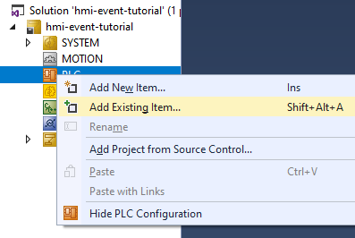
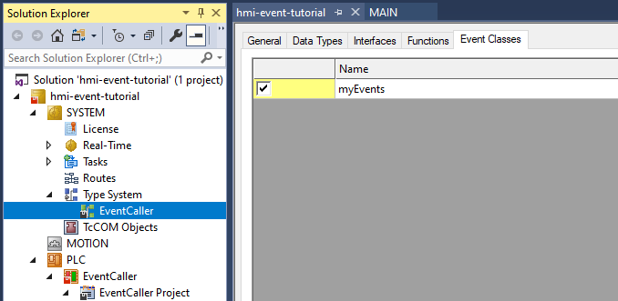
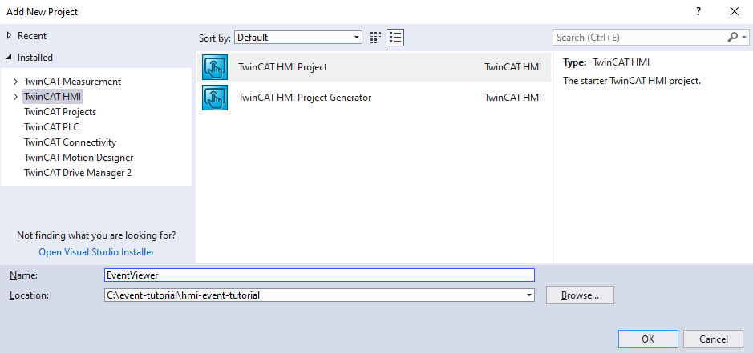
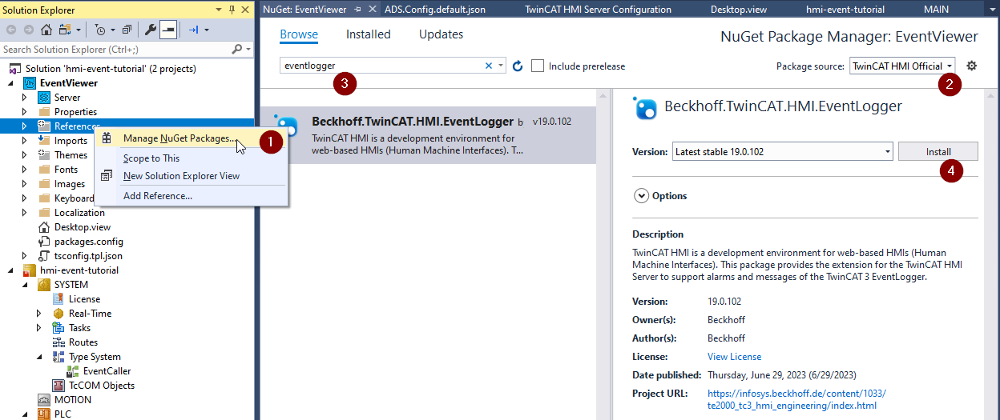
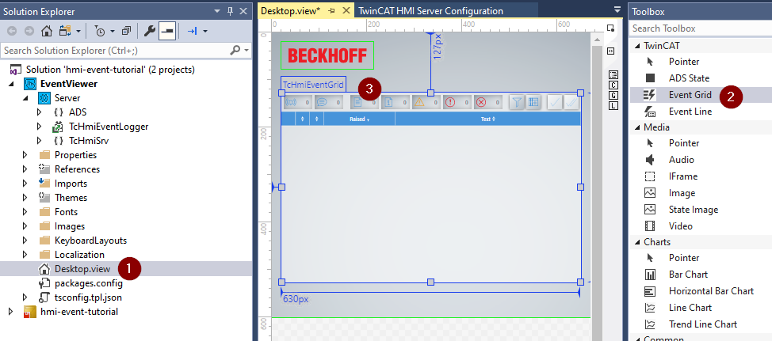
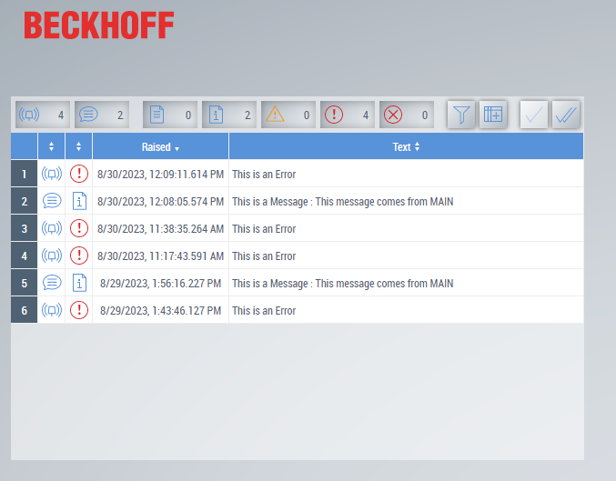

# TwinCAT Events - HMI and PLC basics

This repository contains the components of an example project to see how the TwinCAT eventlogger functions in combination with the TwinCAT HMI (TE2000/TF2000). The goal is to take the components and put them together to get a functioning event grid in the TwinCAT HMI. Please follow the instructions below.

## Instructions

1. Open a new TwinCAT project \

2. Import the PLC project - `EventCaller.tpzip`\

3. Add the necessary Event Classes \
    1. Under `SYSTEM^Type System`, right click and choose `Add Existing Item...`
    2. Choose the `EventCaller.tmc` file.
    
4. Check if the project compiles => `Ctrl+Shift+B`
5. If everything passes, activate the configuration and check if the PLC is running
6. Add a new TwinCAT HMI project

7. Add the `Beckhoff.TwinCAT.HMI.EventLogger` Nuget package to the project

8. Open `Desktop.view` and drag-and-drop the Event Grid control from the toolbox to the page.
 
9. Open the live view and trigger events from the PLC by setting the provided boolean values. You should see the triggered shown in the Event Grid.

Feel free to let me know if anything is unclear or when you run into issues.

## Feature overview

### PLC
A few basic features are contained in the provided PLC and `.tmc` file. In this case we import the events from a `.tmc` file, but you can also add these manually in the Type System. Take a look through the predefined events to see how basic events are implemented. The `myMessage` event is defined with parameters, which are then set in the PLC. In this case it is done on initialisation, but it can also be done dynamically to reflect the actual state of the system when a message is triggered. 

Another option is to add json attributes to a triggered event, this can be used by the HMI to show additional information or trigger functions (see below for documentation references). 

### HMI
The Event Grid is configured by default to show basic information about the triggered events. The columns can be edited by changing the column specification in the Properties window when the control is selected. A filter is available on the control itself, but this filter can be initialised to a preferred setting, also from the Properties panel. Another control is available: the `Event Line`, which is a light-weigth version which can be used to make a custom event visualisation system in combination with `TcHmiRegion` controls and `.content` pages.

### Requirements
- TwinCAT 3.1.4024.x (Tested on 4024.47)
- TwinCAT HMI - TE2000 1.12.x (Tested on 1.12.760.44)

### References
- TwinCAT HMI Documentation: [infosys](https://infosys.beckhoff.com/content/1033/te2000_tc3_hmi_engineering/index.html)
    - Event System: [infosys](https://infosys.beckhoff.com/content/1033/te2000_tc3_hmi_engineering/26698403957888680715.html)
    - Event JSON attributes: [infosys](https://infosys.beckhoff.com/content/1033/tc3_eventlogger/5057920779.html)
- TwinCAT EventLogger Documentation: [infosys](https://infosys.beckhoff.com/content/1033/tc3_eventlogger/index.html)